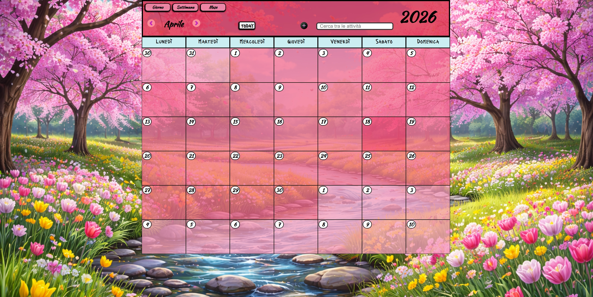
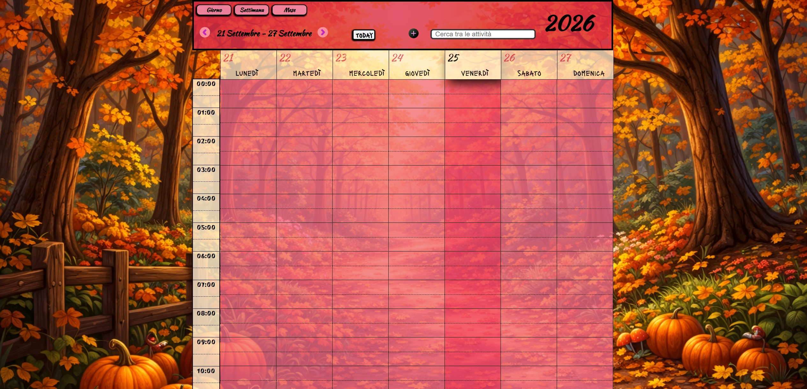
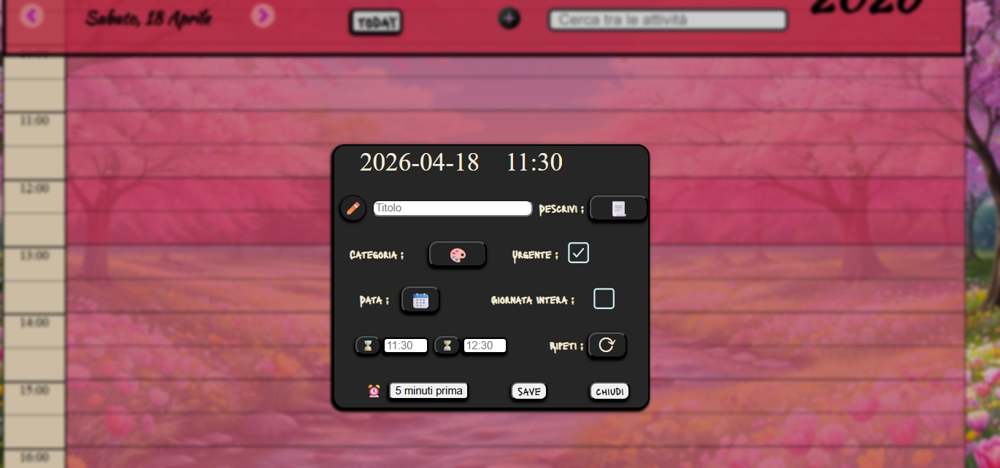
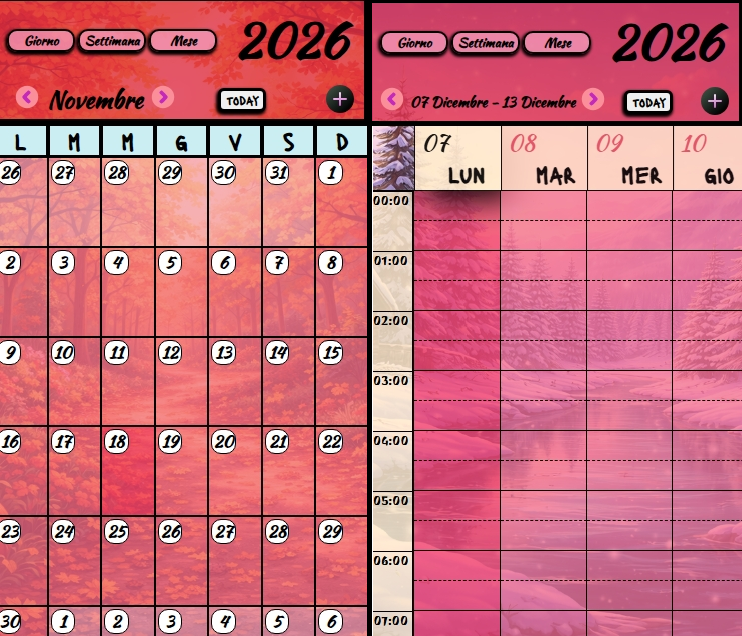

# 🗓️ CalendarHub

A modular calendar application built from scratch using vanilla JavaScript.

The project focuses on **state synchronization**, **interactive UI design**, and a scalable architecture supporting multiple views (month, week, day) and event creation.

---

## ⚙️ Features

- Fully synchronized **Month, Week, and Daily views**
- Centralized state management (single source of truth)
- Interactive grid system:
  - Click-based navigation
  - Time-slot interaction
- Event creation modal:
  - Opens from all views
  - Pre-filled date and time
- Mini calendar for quick date navigation
- Dynamic seasonal background system
- Responsive layout
- Modular architecture (separated logic and UI)

---

## 🚀 Current Version

- [v0.5 – Major refactor and event system](./README-this-version-0.5.md)

---

## 🔮 Next Updates

- Complete **event system logic** (creation, rendering, persistence)
- Add **event visualization inside calendar grid**
- Implement **date & time format switch (EU ↔ US)**
- Complete **To-Do list functionality**
- Improve UI consistency and interactions

---

## 🖼️ Preview

### 📅 Month View

### 📆 Week View

### 📆 Daily View

### 📆 Mobile View

---

## 🕓 Old Versions

Previous versions are available in the **Versions branch**:

➡️ [Go to old versions](https://github.com/ManuelCappai94/CalendarHub/tree/versions)

Each folder contains a specific release with its own README and source code.

---

## 🧩 Tech Stack

- JavaScript (ES6+)
- HTML5
- CSS3 (Grid, Flexbox)
- [Day.js](https://day.js.org/)

---

## 🧩 Assets & Credits

- Trash bin icon by [dDara](https://www.freepik.com/icon/bin_2602768) (Freepik License)
- Custom icons and textures created with **Piskel**
