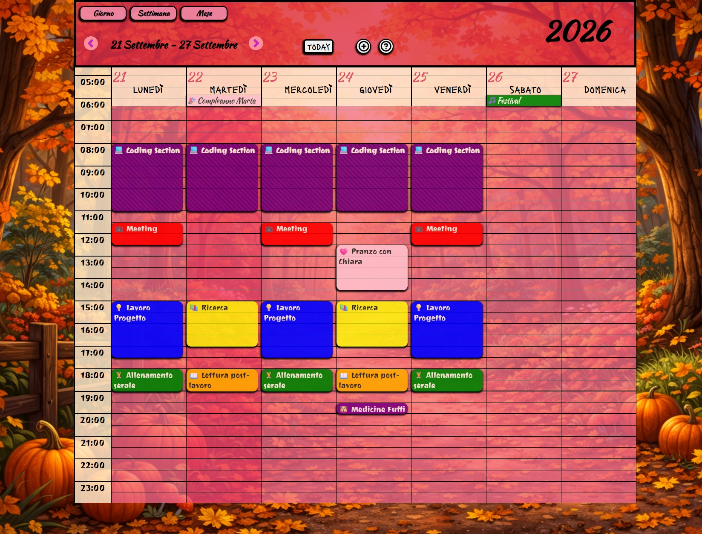
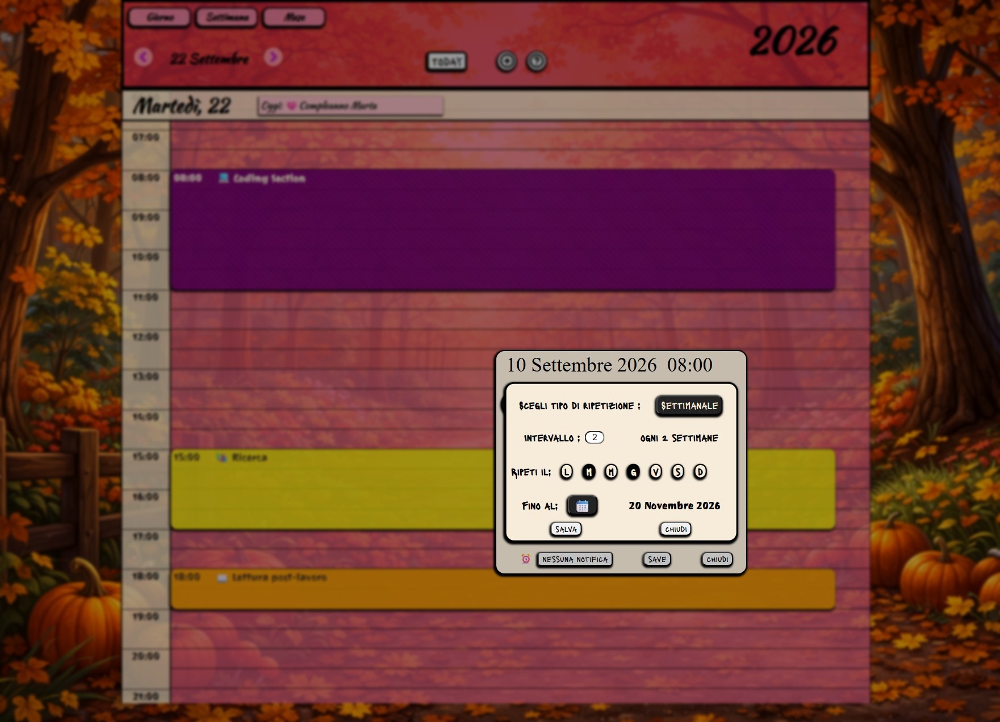
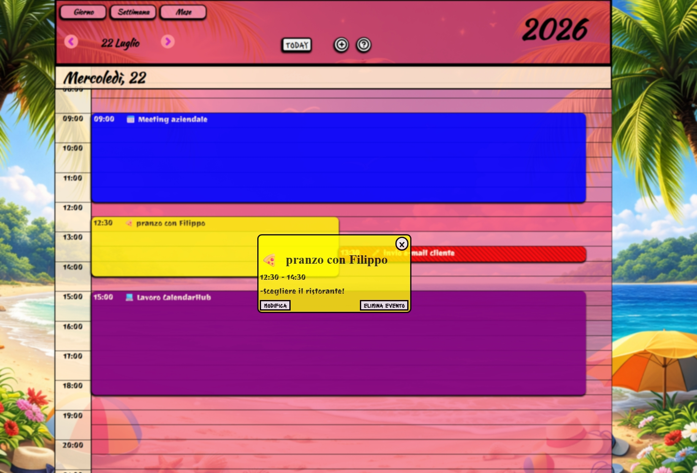

# 🗓️ CalendarHub

A modular calendar application built entirely from scratch using vanilla JavaScript.

CalendarHub focuses on **scalable architecture**, **state synchronization**, and advanced **event management systems**, including recurring events, runtime occurrence generation, contextual UI interactions, synchronized multi-view rendering, and date-based ToDo list management.

The project is designed as a long-term architecture-focused application rather than a simple CRUD calendar demo.

---

## 🚀 Live Demo

➡️ [Open CalendarHub Demo](https://manuelcappai94.github.io/CalendarHub/)

---

## ⚙️ Features

* Fully synchronized **Month, Week, and Daily views**
* Centralized state management (**single source of truth**)
* Advanced event management system:

  * Event creation, editing and deletion
  * Context-aware modal opening
  * Preloaded date & time synchronization
  * Event customization with title, description, icon and color
  * Contextual info banner for quick event inspection
  * Series editing and deletion
* Recurring events system:

  * Daily, weekly, monthly and custom recurrence
  * Runtime occurrence generation
  * Single occurrence exceptions
  * Single occurrence editing and deletion
  * Interval-based recurrence
  * End-date limitation
  * Multi-day weekly selection
* Interactive grid system:

  * Click-based navigation
  * Time-slot interaction
  * Context-aware event creation
* Interactive mini calendar for fast date navigation
* Manual date input and date selection flow
* Dynamic seasonal background system
* Date-based ToDo List system:

  * ToDo list creation
  * ToDo item creation
  * Completion tracking
  * Item and list deletion
  * Saved list rehydration
  * Calendar indicators in Month, Week and Daily views
  * Contextual menu for reopening saved ToDo lists
* Dedicated onboarding tutorial with chapter navigation
* Modular architecture with separated UI and logic layers
* Responsive interaction model optimized for desktop and mobile

---

## 🧠 Technical Highlights

* Modular vanilla JavaScript architecture
* Centralized calendar synchronization flow
* Dynamic rendering across multiple calendar views
* Runtime recurring event generation
* Exception-based recurring event handling
* Context-aware modal and UI opening logic
* Contextual floating UI positioning system
* Date-based ToDo persistence and rehydration
* Reusable badge rendering across Month, Week and Daily views
* localStorage-based persistence
* DOM-driven interface updates
* Responsive modal and interaction logic
* Semantic and accessibility-oriented UI improvements

---

## 🚀 Current Version

### v0.9 – ToDo List, tutorial navigation and UI refinement

Version 0.9 expands CalendarHub with a complete date-based ToDo List system and improves several parts of the user experience.

Main additions:

* Complete ToDo List system linked to selected calendar dates
* ToDo list creation, deletion and saved-list rehydration
* ToDo item creation, deletion and completion tracking
* ToDo badges rendered across Month, Week and Daily views
* Contextual ToDo menu for selecting saved lists by date
* ToDo panel backdrop layer to prevent accidental calendar interactions
* Tutorial chapter navigation
* Updated tutorial slides, including ToDo List usage
* Active tutorial chapter highlighting
* Improved tutorial modal structure
* Navbar semantic refactor using real button elements
* Improved accessibility labels for icon-based controls
* Mini calendar integration from the main date/year controls
* Additional UI and positioning refinements

---

## 🧩 Core Architecture

CalendarHub uses a centralized synchronization flow to keep all calendar views aligned.

The main calendar views:

* Month
* Week
* Daily
* Mini calendar

share a common date state and rendering logic, allowing the interface to stay synchronized when the user changes view, selects dates, creates events, edits events, manages recurring events, or opens contextual UI elements.

The goal of this architecture is to:

* Maintain UI consistency
* Avoid duplicated rendering logic
* Simplify future scalability
* Keep all views synchronized automatically

---

## 🔁 Recurring Event System

CalendarHub includes a recurring event system designed to avoid storing every generated occurrence separately.

Instead of saving each repeated event as an independent item, the application stores the original recurring event and dynamically generates its visible occurrences at runtime before rendering them across the calendar views.

The recurring system supports daily, weekly, monthly and custom repetitions, including intervals, end dates, and multiple selected weekdays.

Recurring events also support an exception-based flow. When a single occurrence is edited or deleted, CalendarHub preserves the original recurring series and stores the specific change as an exception. This keeps the recurring chain consistent while still allowing individual occurrences to behave differently when needed.

This approach keeps recurring events scalable, flexible and easier to synchronize across Month, Week and Daily views.

---

## ✅ ToDo List System

Version 0.9 introduces a date-based ToDo List system integrated with the calendar.

Users can create ToDo lists for selected days, add activities, mark items as completed, delete individual items, delete full lists, and reopen saved lists from calendar indicators.

The system supports:

* localStorage persistence
* multiple ToDo lists for the same day
* saved list rehydration
* item completion tracking
* automatic progress counter
* indicators in Month, Week and Daily views
* contextual menu for reopening saved lists

The ToDo system is integrated into the calendar date flow without duplicating the core calendar logic.

---

## 🧭 Tutorial System

CalendarHub includes an onboarding tutorial designed to explain the main features of the application.

Version 0.9 improves the tutorial with:

* Semantic modal structure
* Chapter-based navigation
* Active chapter highlighting
* Updated tutorial content
* ToDo List explanation
* Restart option from the navigation bar

---

## 🖼️ Preview

### 📅 Month View

### 📆 Week View

### 📆 Daily View + Event System

### 📌 Contextual Info Banner

---

## 🧩 Tech Stack

* JavaScript ES6+
* HTML5
* CSS3
* CSS Grid
* Flexbox
* Day.js
* localStorage

---

## 🔮 Planned v1.0 Improvements

Planned work for version 1.0 includes:

* Browser notification system
* Final UI and UX polish
* Targeted semantic HTML refactor in selected areas
* Additional accessibility improvements
* Targeted localization refactor for hardcoded UI text
* Review of Italian/English text handling
* Additional desktop and mobile testing
* Final cleanup before the 1.0 release

---

## 🧭 Possible Long-Term Additions

Possible long-term improvements include:

* Drag-and-drop scheduling
* Advanced notification scheduling
* Internationalization support
* Electron desktop version exploration
* Cloud synchronization
* Account system
* Backend persistence layer

These are long-term directions and not part of the immediate 1.0 scope.

---

## 🧩 Assets & Credits

* Trash bin icon by [dDara](https://www.freepik.com/icon/bin_2602768) under Freepik License
* Custom icons and textures created with Piskel

